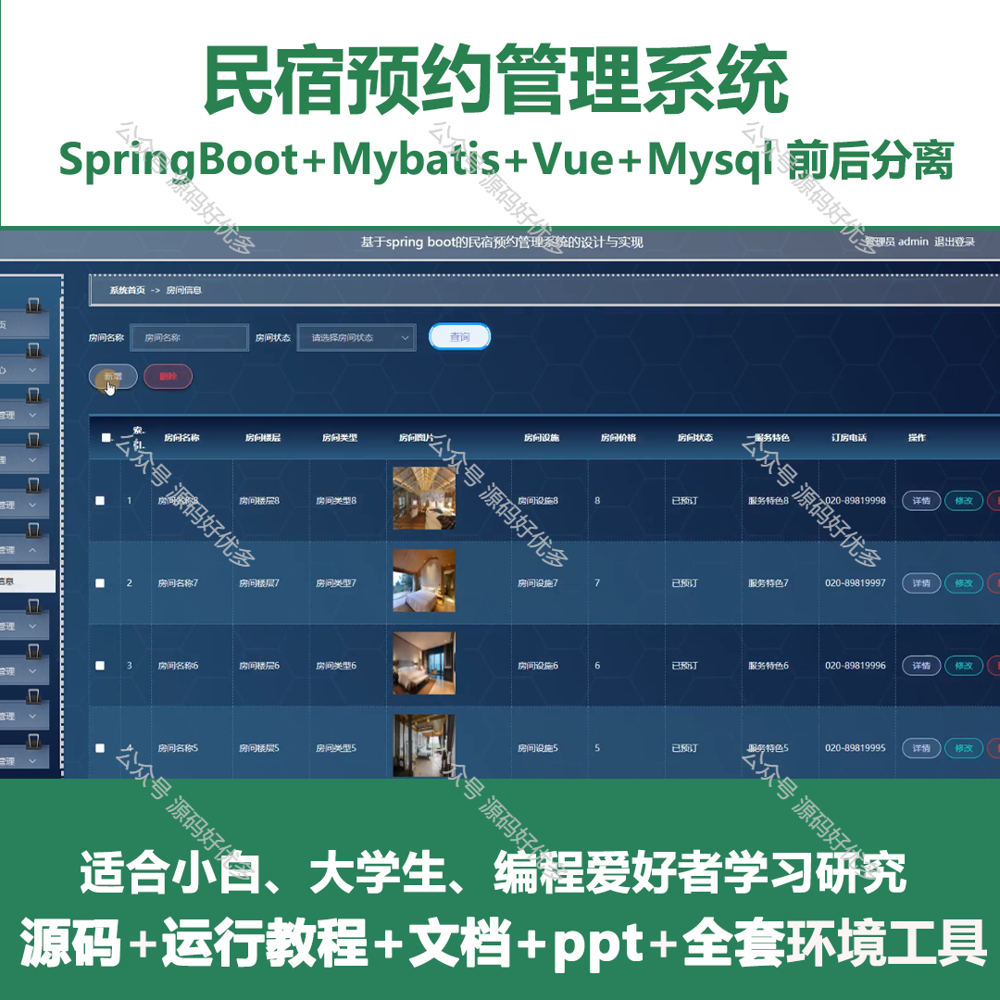
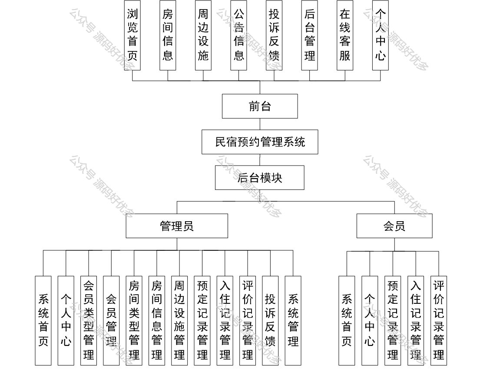
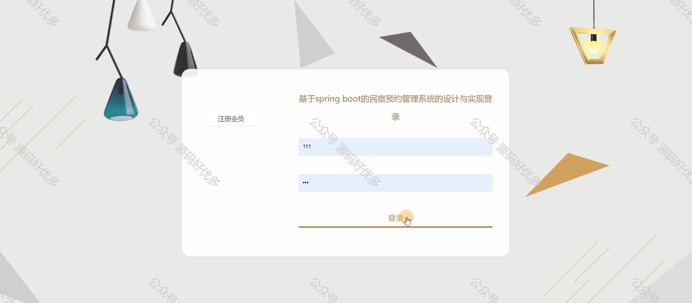
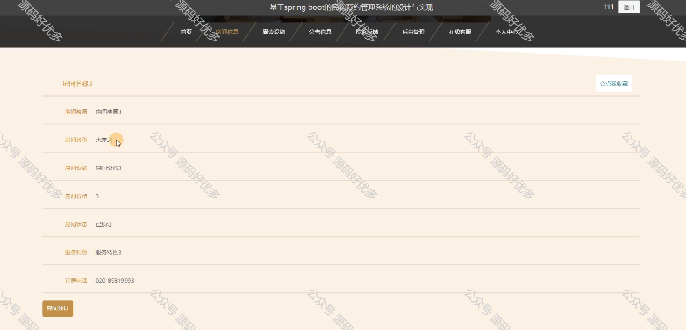
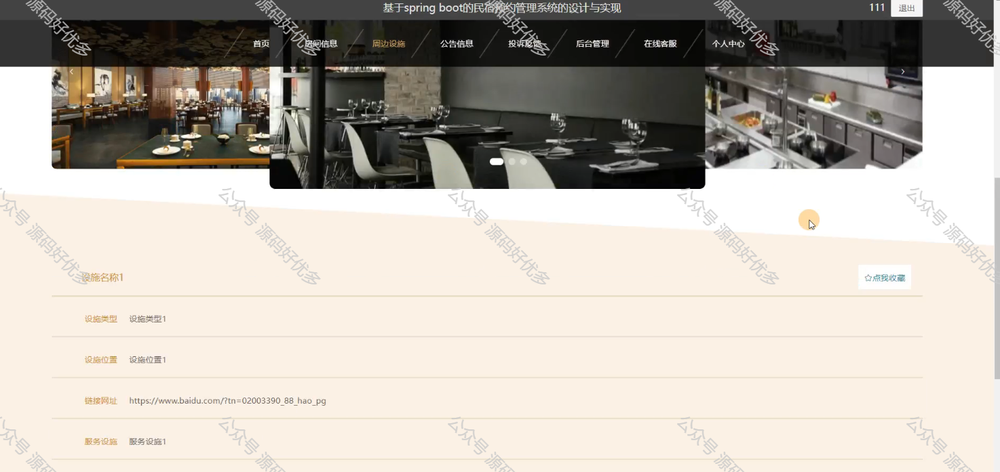
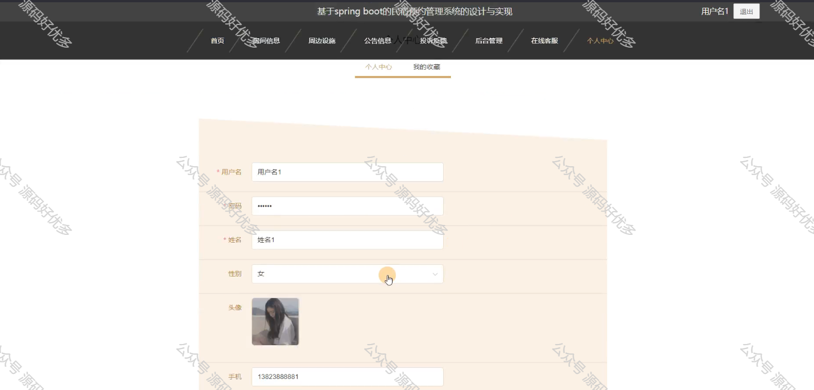
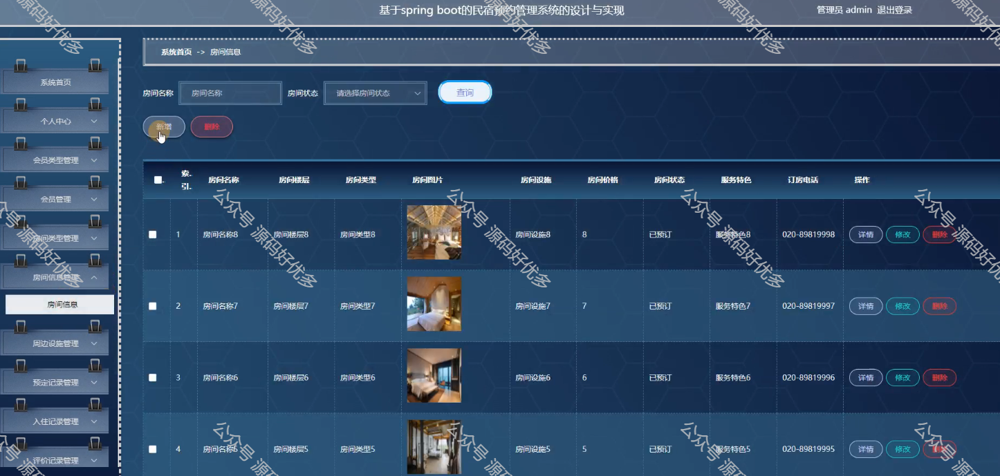
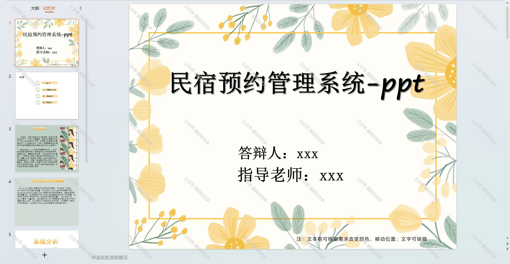
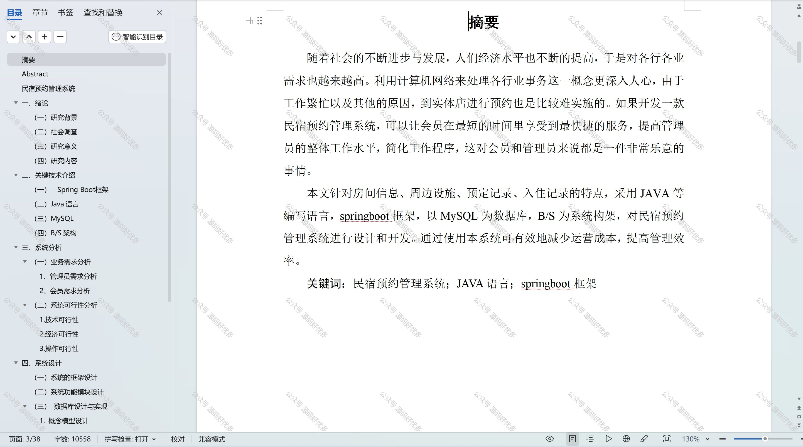

# springbootA327
springbootA327民宿预约管理系统LW+PPT
 
## 查看主页获取源码

### 一、作品包含

源码+数据库+设计文档万字+PPT+全套环境和工具资源+部署教程

### 二、项目技术

前端技术：Html、Css、Js、Vue、Element-ui

数据库：MySQL

后端技术：Java、Spring Boot、MyBatis

  

### 三、运行环境

开发工具：IDEA/eclipse

数据库：MySQL5.7

数据库管理工具：Navicat10以上版本

环境配置软件： JDK1.8+Maven3.6.3

前端Nodejs：14

### 四、项目介绍
项目编号：springbootA327

民宿预约管理系统是在民宿行业迅速发展的背景下应运而生的一种信息化管理工具，它旨在解决民宿业主在房源管理、预订处理、客户服务等方面遇到的难题，通过提供在线预订、支付、客户信息管理等功能，提高民宿运营效率，优化客户体验，同时助力民宿业者更好地把握市场动态，提升业务竞争力。

前台用户功能：浏览首页、房间信息、周边设施、公告信息、投诉反馈、后台管理、在线客服、个人中心。

后台分为管理员和用户
管理员的功能：系统首页、个人中心、会员类型管理、会员管理、房间类型管理、房间信息管理、周边设施管理、预定记录管理、入住记录管理、评价记录管理、投诉反馈、系统管理。
用户的功能：系统首页、个人中心、预定记录管理、入住记录管理、评价记录管理。

### 五、运行截图

  
